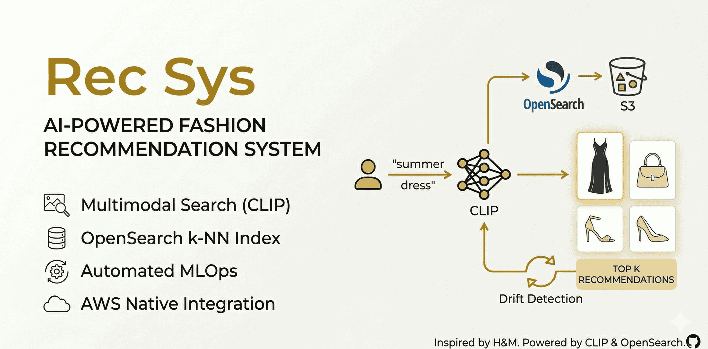
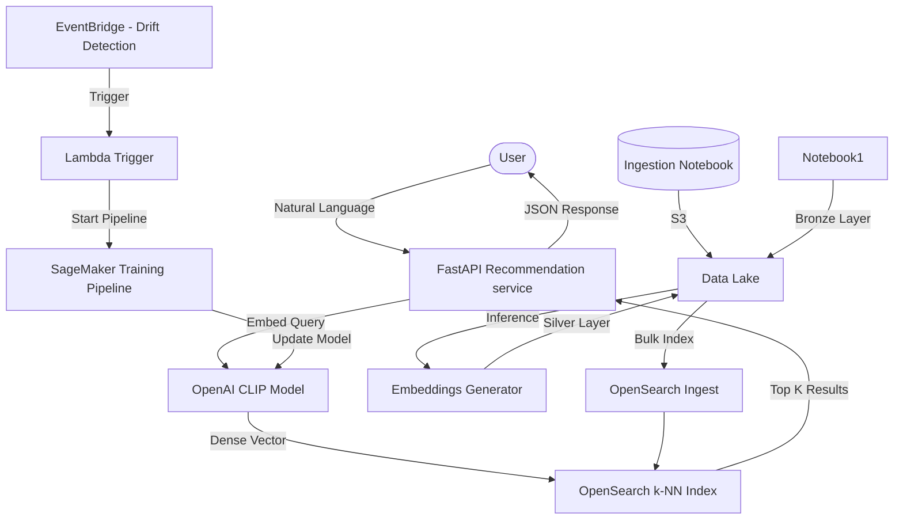

# AI-Powered Fashion Recommendation System



## Overview
This repository contains an end-to-end Machine Learning Recommendation System designed for high-end fashion retail (inspired by H&M). It leverages **CLIP (Contrastive Language-Image Pre-training)** for multimodal embeddings and **OpenSearch** for high-performance k-NN hybrid search.

The system allows users to search for fashion items using natural language queries, matching them against both image features and textual metadata.

## Core Features
- **Multimodal Search**: Query with text to find visually similar items using CLIP embeddings.
- **k-NN OpenSearch Index**: Efficient vector search in the cloud.
- **MLOps Integration**: Automated retraining pipeline triggered by data drift detection via AWS Lambda.
- **Scalable Ingestion**: Streaming ingestion from S3 using Python generators to minimize memory footprint.

## Architecture



## Getting Started

### Prerequisites
- Python 3.11+
- AWS Account (S3, OpenSearch, SageMaker)
- Kaggle API credentials (for dataset ingestion)

### Installation
1. Clone the repository:
   ```bash
   git clone https://github.com/your-username/shopping-recommendation.git
   cd shopping-recommendation
   ```

2. Create and activate a virtual environment:
   ```bash
   python -m venv .venv
   source .venv/bin/activate  # Windows: .venv\Scripts\activate
   ```

3. Install dependencies:
   ```bash
   pip install -r requirements.txt
   ```

4. Configure environment variables:
   ```bash
   cp .env.example .env
   # Edit .env with your actual credentials
   ```

## Usage

### Running the API
```bash
uvicorn main:app --reload
```
The API will be available at `http://localhost:8000`. You can access the interactive docs at `/docs`.

### Notebooks Workflow
1. `ingest_to_s3.ipynb`: Downloads H&M dataset from Kaggle and uploads to S3 Bronze layer.
2. `embeddings_generator.ipynb`: Loads CLIP model, processes images from S3, and generates embeddings (Silver layer).
3. `knn_index_opensearch.ipynb`: Creates the k-NN index in OpenSearch and performs bulk ingestion.

## Testing
We use `pytest` for automated testing.
```bash
pytest
```
Tests are automatically run via GitHub Actions on every push to the `main` branch.

## License
MIT
